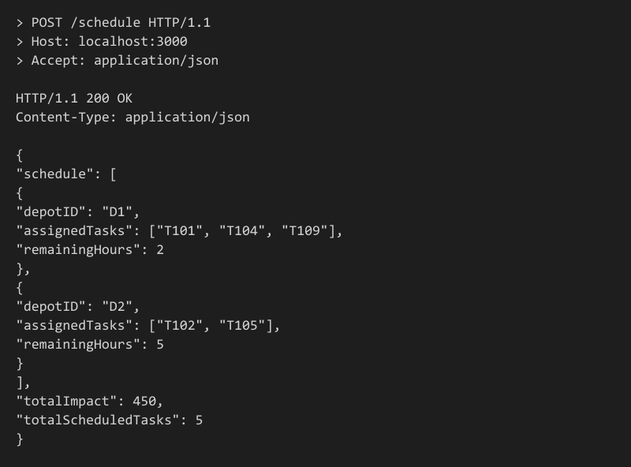
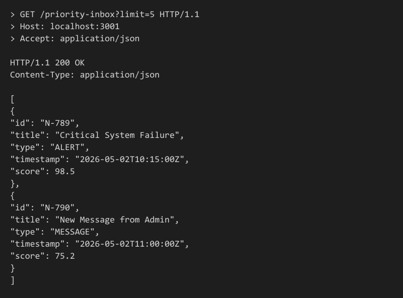

# Affordmed Campus Hiring Evaluation - Backend

This repository contains the completed backend evaluation assignments, consisting of two microservices and a system design document.

## Repository Structure

- **`vehicle_maintenance_scheduler/`** (Stage 1)
  - A Node.js/Express microservice that solves the Multiple Knapsack Problem for scheduling daily vehicle maintenance to maximize impact without exceeding depot mechanic-hours.
- **`logging_middleware/`** 
  - A standalone Node.js middleware module that intercepts all requests/responses, formats them according to the mandated Affordmed JSON schema, and pushes them to the external `/log` endpoint.
- **`notification_app_be/`** (Stage 6)
  - A secondary Node.js/Express microservice that fetches notifications, applies a custom scoring algorithm (combining weight and recency), and exposes an endpoint for a Priority Inbox.
- **`Notification_System_Design.md`** (Stages 2-5)
  - Comprehensive answers for the database schema design, slow query composite indexing, caching solutions for high traffic loads, and the message-broker architecture for mass notification processing.

## Setup & Execution

### Prerequisites
- [Node.js](https://nodejs.org/) (v16 or higher recommended)
- `npm`

### 1. Vehicle Maintenance Scheduler
```bash
cd vehicle_maintenance_scheduler
npm install
```
Create a `.env` file in the `vehicle_maintenance_scheduler` directory with the following variables:
```env
CLIENT_ID=your_client_id
CLIENT_SECRET=your_client_secret
PORT=3000
API_BASE_URL=http://20.207.122.201/evaluation-service
```
Run the service:
```bash
node src/index.js
```
- **Endpoint:** `POST /schedule`

### 2. Notification Priority Inbox
```bash
cd notification_app_be
npm install
```
Create a `.env` file in the `notification_app_be` directory with the identical variables (use `PORT=3001`).
Run the service:
```bash
node src/index.js
```
- **Endpoint:** `GET /priority-inbox?limit=10`

## Sample Outputs (Screenshots)

### Vehicle Maintenance Scheduler Output
When making a `POST` request to `/schedule`, the API resolves the Multiple Knapsack Problem and returns the scheduled tasks per depot:



### Notification Priority Inbox Output
When making a `GET` request to `/priority-inbox?limit=5`, the API ranks notifications by the custom weight-recency score:



## Author
Chethan Reddy Kamireddy
